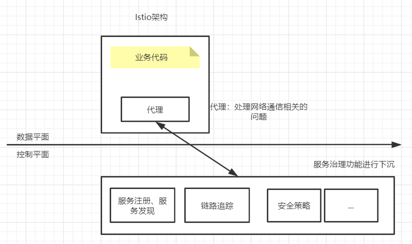
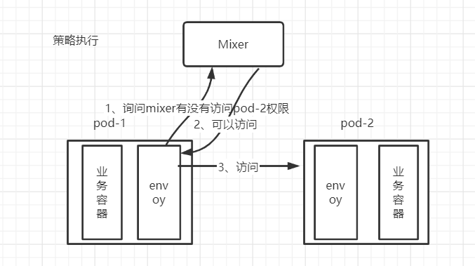
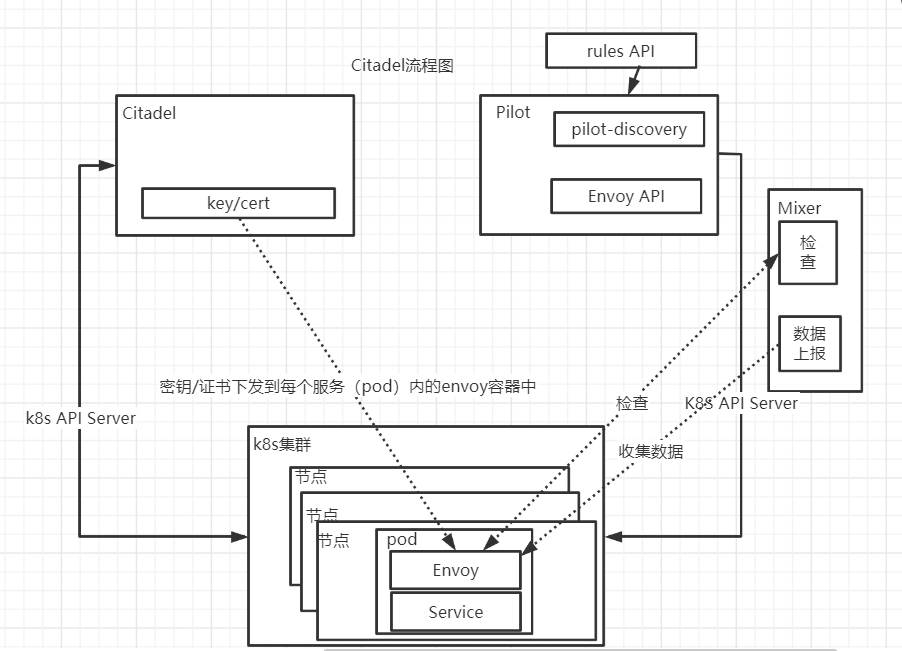
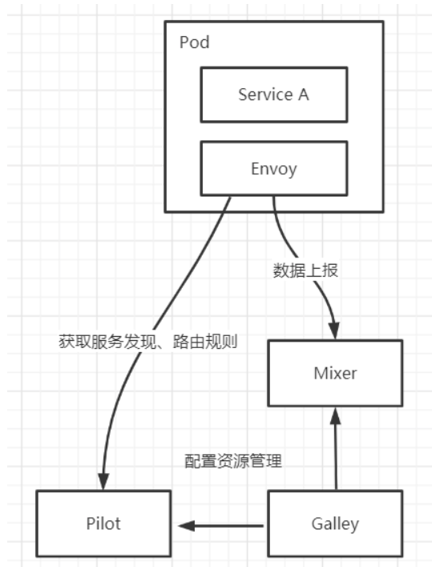

# Istio


## 0. 参考资料

```
itcast

https://www.bilibili.com/video/BV1Uv411a78L?p=21&spm_id_from=pageDriver
https://www.bilibili.com/video/BV1vE411p7wX?p=3
https://www.bilibili.com/video/BV1864y1D7WD?p=2&spm_id_from=pageDriver
https://www.bilibili.com/video/BV1vt411H755?from=search&seid=13199869994230798705

https://www.servicemesher.com/istio-handbook/concepts/traffic-control.html
```


## 1. 架构发展史

```
step1:单机时代
step2:垂直拆分
step3:负载均衡
step4:服务化改造
	虽然系统经过了垂直拆分，但是拆分之后发现在论坛和聊天室中有重复的功能，比如，用户注册、发邮件等等，一旦项目大了，集群部署多了，这些重复的功能无疑会造成资源浪费，所以会把重复功能抽取出来，名字叫"XX服务（Service）"， 这个过程就是服务化改造
	
step5:服务治理
	随着业务的增大，基础服务越来越多，调用网的关系由最初的几个增加到几十上百，造成了调用链路错综复杂,需要对服务进行治理。

    服务治理要求：
    1、当我们服务节点数几十上百的时候，需要对服务有动态的感知，引入了注册中心
    2、当服务链路调用很长的时候如何实现链路的监控
    3、单个服务的异常，如何能避免整条链路的异常（雪崩），需要考虑熔断、降级、限流
    4、服务高可用需要负载均衡

    典型框架比如有：Dubbo, 默认采用的是Zookeeper作为注册中心。
    

step6:(分布式)微服务时代
	微服务是在2012年提出的概念，微服务的希望的重点是一个服务只负责一个独立的功能。

    拆分原则，任何一个需求不会因为发布或者维护而影响到不相关的服务，一切可以做到独立部署运维。

    比如传统的“用户中心”服务，对于微服务来说，需要根据业务再次拆分，可能需要拆分成“买家服务”、“卖家服务”、“商家服务”等。

    典型代表：Spring Cloud，相对于传统分布式架构，SpringCloud使用的是HTTP作为RPC远程调用，配合上注册中心Eureka和API网关Zuul，可以做到细分内部服务的同时又可以对外暴露统一的接口，让外部对系统内部架构无感，此外Spring Cloud的config组件还可以把配置统一管理。
    
    
step7: 服务网格新时期(service mesh)
	早期
		我们最开始用Spring+SpringMVC+Mybatis写业务代码
		
	微服务时代
		微服务时代有了Spring Cloud就完美了吗？不妨想一想会有哪些问题?
		
	解决思路
        - 本质上是要解决服务之间通信的问题，不应该将非业务的代码融合到业务代码中 
        - 也就是从客户端发出的请求，要能够顺利到达对应的服务，这中间的网络通信的过程要和业务代码尽量无关
	
	解决方案：
		把网络通信，流量转发等问题放到了计算机网络模型中的TCP/UDP层，也就是非业务功能代码下沉，把这些网络的问题下沉到计算机网络模型当中，也就是网络七层模型
		网络七层模型：应用层、表示层、会话层、传输层、网络层、数据链路层、物理层

	SideCar：
		它降低了与微服务架构相关的复杂性，并且提供了负载平衡、服务发现、流量管理、服务中断、遥测、故障注入等功能特性。
        Sidecar模式是一种将应用功能从应用本身剥离出来作为单独进程的方式。该模式允许我们向应用无侵入添加多种功能，避免了为满足第三方组件需求而向应用添加额外的配置代码。
        
        可以理解成是代理，控制了服务的流量的进出，sidecar是为了通用基础设施而设计，可以做到与公司框架技术无侵入性
        
    Linked:
    	Linkerd除了完成对Service Mesh的命名，以及Service Mesh各主要功能的落地，还有以下重要创举：
            - 无须侵入工作负载的代码，直接进行通信监视和管理；
            - 提供了统一的配置方式，用于管理服务之间的通信和边缘通信；
            - 除了支持Kubernetes，还支持多种底层平台。
	
		问题: 在早期的时候又要部署服务，又要部署sidecar，对于运维人员来说比较困难的，所以没有得到很好的发			展，其实主要的 问题是Linkerd只是实现了数据层面的问题，但没有对其进行很好的管理。 
		数据层面:通过sidecar解决了数据处理的问题
	
	Istio:
		由Google、IBM和Lyft共同发起的开源项目
		
	  	定义:
	  		通过Istio，可以轻松创建带有负载平衡，服务到服务的身份验证，监视等功能的已部署服务网络，使得服务中的代码更改很少或没有更改。 通过在整个环境中部署一个特殊的sidecar代理来拦截微服务之间的所有网络通信，然后	使用其控制平面功能配置和管理，可以为服务添加Istio支持
	    
	    作用：
	        1.HTTP、gRPC、WebSocket和TCP流量的自动负载平衡。
            2.路由、重试、故障转移和故障注入对流量行为进行细粒度控制。
            3.支持访问控制、速率限制、配置API。
            4.集群内所有流量的自动衡量、日志和跟踪，包括集群入口和出口。
            5.使用基于身份验证和授权来保护集群中服务跟服务之间的通信。
            
     服务网格
         
     service mesh
         解决开发与运维部署分布式微服务面临的问题, 也是解决微服务之间服务跟服务之间通信的问题，可以包括服务发现、负载平衡、故障恢复、度量和监视，服务网格通常还具有更复杂的操作需求，如A/B测试、速率限制、访问控制和端到端身份验证.
          google istio	
          蚂蚁   sofa Mesh
          腾讯   Tencent Service Mesh    
```

## 2. 简介

```
它的初始设计目标是在Kubernetes的基础上，以非侵入的方式为运行在集群中的微服务提供流量管理、安全加固、服务监控和策略管理等功能。

Istio有助于降低部署的复杂性，并减轻开发团队的压力。
它是一个完全开放源代码的服务网格，透明地分层到现有的分布式应用程序上。
它也是一个平台，包括允许它集成到任何日志平台、遥测或策略系统中的api。

Istio的多种功能集使我们能够成功、高效地运行分布式微服务体系结构，并提供一种统一的方式来保护、连接和监视微服务。

Istio是基于Sidecar模式、数据平面和控制平面、是主流Service Mesh解决方案。
```




## 3. 架构

```
Istio的架构，分为控制平面和数据面平两部分。
- 控制平面：管理并配置代理来进行流量路由。此外，控制平面配置 Mixer 来执行策略和收集遥测数据。
- 数据平面：由一组智能代理（[Envoy]）组成，被部署为 sidecar。这些代理通过一个通用的策略和遥测中心传递和控制微服务之间的所有网络通信。
```


```
Pilot：   提供了服务发现，负载均衡，路由规则(分发，也叫流量治理)
Mixer：   策略控制，比如：服务调用速率限制； 还有服务监控，比如：监控指标、日志和调用链
Citadel： 访问安全，比如：服务跟服务通信的加密

Sidecar/Envoy: 代理，处理服务的流量

Gateway： 外部服务通过Gateway访问入口将流量转发到服务前端服务内的Envoy组件，ingressgateway

1. 自动注入
	由架构图得知前端服务跟后端服务都有envoy,我们这里以前端服务envoy为例说明）指在创建应用程序时自动注入 Sidecar代理。那什么情况下会自动注入你？在 Kubernetes场景下创建 Pod时，Kube-apiserver调用管理平面组件的 Sidecar-Injector服务，然后会自动修改应用程序的描述信息并注入Sidecar。在真正创建Pod时，在创建业务容器的同时在Pod中创建Sidecar容器。
	
	# 原始的yaml文件
    apiVersion: apps/v1
    kind: Deployment
    spec: 
        containers: 
        - name: nginx  
          image: nginx  
            ...省略
	
	# 调用Sidecar-Injector服务之后，yaml文件会发生改变
	
	# 新的yaml文件
    apiVersion: apps/v1
    kind: Deployment
    spec: 
        containers: 
        - name: nginx  
          image: nginx  
        ...省略
        # 增加一个容器image地址		
        containers: 
        - name: sidecar  
          image: sidecar  
        ...省略

	总结：会在pod里面自动生产一个代理，业务服务无感知 

2. 流量拦截
	在 Pod 初始化时设置 iptables 规则，当有流量到来时，基于配置的iptables规则拦截业务容器的入口流量和出口流量到Sidecar上。但是我们的应用程序感知不到Sidecar的存在，还以原本的方式进行互相访问。在架构图中，流出前端服务的流量会被 前端服务侧的 Envoy拦截，而当流量到达后台服务时，入口流量被后台服务V1/V2版本的Envoy拦截
	网卡
	数据包
	iptables
	（转发）
	业务容器 + 代理容器pod, 创建pod的时候会给Iptables配置路由规则
	
	总结：每个pod中都会有一个代理来来拦截所有的服务流量（不管是入口流量还是出口流量）

3. 服务发现
	前端服务怎么知道后端服务的服务信息呢？这个时候就需要服务发现了，所以服务发起方的 Envoy 调用控制面组件 Pilot 的服务发现接口获取目标服务的实例列表。在架构图中，前端服务内的 Envoy 通过 控制平面Pilot 的服务发现接口得到后台服务各个实例的地址，为访问做准备。

	总结：Pilot提供了服务发现功能，调用方需要到Pilot组件获取提供者服务信息

4. 负载均衡
	数据面的各个Envoy从Pilot中获取后台服务的负载均衡衡配置，并执行负载均衡动作，服务发起方的Envoy（前端服务envoy）根据配置的负载均衡策略选择服务实例，并连接对应的实例地址。

	总结：Pilot也提供了负载均衡功能，调用方根据配置的负载均衡策略选择服务实例

5. 流量治理(路由分发)
	Envoy 从 Pilot 中获取配置的流量规则，在拦截到 入口 流量和出口 流量时执行治理逻辑。比如说，在架构图中，前端服务的 Envoy 从 Pilot 中获取流量治理规则，并根据该流量治理规则将不同特征的流量分发到后台服务的v1或v2版本。当然，这只是Istio流量治理的一个场景，Istio支持更丰富的流量治理能力。
	
	总结：Pilot也提供了路由转发规则

6. 访问安全
 	在服务间访问时通过双方的Envoy进行双向认证和通道加密，并基于服务的身份进行授权管理。在架构图中，Pilot下发安全相关配置，在前端模块服务和后端服务的Envoy上自动加载证书和密钥来实现双向认证，其中的证书和密钥由另一个控制平面组件Citadel维护。

    总结：Citadel维护了服务代理通信需要的证书和密钥

7. 服务遥测(服务监控)
	在服务间通信时，通信双方的Envoy都会连接控制平面组件Mixer上报访问数据，并通过Mixer将数据转发给对应的监控后端。比如说，在架构图中，前端模块服务对后端服务的访问监控指标、日志和调用链都可以通过Mixer收集到对应的监控后端。
	
	总结：Mixer组件可以收集各个服务上的日志，从而可以进行监控
	
8. 策略执行
	在进行服务访问时，通过Mixer连接后端服务来控制服务间的访问，判断对访问是放行还是拒绝。在架构图中，数据面在转发服务的请求前调用Mixer接口检查是否允许访问，Mixer 会做对应检查，给代理（Envoy）返回允许访问还是拒绝, 比如：可以对前端模块服务到后台服务的访问进行速率控制。
	
	总结：Mixer组件可以对服务速率进行控制（也就是限流）
	
9. 外部访问
	在架构图中，外部服务通过Gateway访问入口将流量转发到服务前端服务内的Envoy组件，对前端服务的负载均衡和一些流量治理策略都在这个Gateway上执行。

	总结：这里总结在以上过程中涉及的动作和动作主体，可以将其中的每个过程都抽象成一句话：服务调用双方的Envoy代理拦截流量，并根据控制平面的相关配置执行相应的服务治理动作，这也是Istio的数据平面和控制平面的配合方式。
```


## 4. 组件

### 4.1  Pilot

> Pilot在Istio架构中必须要有
>
> 为什么Envoy能够服务发现？并且Envoy为什么可以流量控制？ 就是因为Pilot存在

```
1. 什么是pilot
Pilot类似传统C/S架构中的服务端Master，下发指令控制客户端完成业务功能。和传统的微服务架构对比，Pilot 至少涵盖服务注册中心和向数据平面下发规则等管理组件的功能。

2. 服务注册中心(图3)
Pilot 为Envoy sidecar提供服务发现、用于智能路由的流量管理功能（例如：A/B 测试、金丝雀发布等）以及弹性功能（超时、重试、熔断器等）。

Pilot本身不做服务注册，它会提供一个API接口，对接已有的服务注册系统，比如Eureka，Etcd等。说白了，Pilot可以看成它是Sidecar的一个领导

基本概念：
	(1)Platform Adapter是Pilot抽象模型的实现版本，用于对接外部的不同平台
	(2)Polit定了一个抽象模型(Abstract model)，处理Platform Adapter对接外部不同的平台， 从特定平台细节中解耦
	(3)Envoy API负责和Envoy的通讯，主要是发送服务发现信息和流量控制规则给Envoy 

流程总结： 
	1.service服务C会注册到Pilot注册中心平台适配器(Platform Adapter)模块上（假如对接的是Eureka, 那么service服务C会注册到Eureka里面）
	2.然后抽象模型(Abstract model)进行平台细节的解耦并且用于处理Platform Adapter对接外部的不同平台，
	3.最后通过Envoy API负责和Envoy的通讯，主要是发送服务发现信息和流量控制规则给Envoy  


3. 数据平面下发规则(图4)
Pilot 更重要的一个功能是向数据平面下发规则，Pilot 负责将各种规则转换换成 Envoy 可识别的格式，通过标准的 协议发送给 Envoy，指导Envoy完成动作。在通信上，Envoy通过gRPC流式订阅Pilot的配置资源。

Pilot将表达的路由规则分发到 Evnoy上，Envoy根据该路由规则进行流量转发，配置规则和流程图如下所示。

规则如下：
# http请求

http:
-match: # 匹配
 -header: # 头部
   cookie:
    # 以下cookie中包含group=dev则流量转发到v2版本中
    exact: "group=dev"
 -route:  # 路由
   -destination:
     name: v2
 -route:
   -destination:
     name: v1 
```

图3


图4


### 4.2 Mixer

> Mixer在Istio架构中不是必须的

```
Mixer分为Policy和Telemetry两个子模块。
Policy用于向Envoy提供准入策略控制，黑白名单控制，速率限制等相关策略；
Telemetry为Envoy提供了数据上报和日志搜集服务，以用于监控告警和日志查询。
```


#### 4.2.1 telemetry

```
Mixer是一个平台无关的组件。Mixer的Telemetry 在整个服务网格中执行访问控制和策略使用，并从 Envoy 代理和其他服务收集遥测数据，流程如下图所示。

遥测报告上报，比如从Envoy中收集数据[请求数据、使用时间、使用的协议等]，通过Adapater上 
报给Promethues、Heapster等 
说白了，就是数据收集，然后通过adapter上传到监控容器里面
```


#### 4.2.2 policy

```
policy是另外一个Mixer服务，和istio-telemetry基本上是完全相同的机制和流程。数据面在转发服务的请求前调用istio-policy的Check接口是否允许访问，Mixer 根据配置将请求转发到对应的 Adapter 做对应检查，给代理返回允许访问还是拒绝。可以对接如配额、授权、黑白名单等不同的控制后端，对服务间的访问进行可扩展的控制。

策略控制：检查请求释放可以运行访问 
```




### 4.3 Citadel

> Citadel在Istio架构中不是必须的

```
Istio的认证授权机制主要是由Citadel完成，同时需要和其它组件一起配合，参与到其中的组件还有Pilot、Envoy、Mixer，它们四者在整个流程中的作用分别为：
    - Citadel：用于负责密钥和证书的管理，在创建服务时会将密钥及证书下发至对应的Envoy代理中；
    - Pilot: 用于接收用户定义的安全策略并将其整理下发至服务旁的Envoy代理中；
    - Envoy：用于存储Citadel下发的密钥和证书，保障服务间的数据传输安全；
    - Mixer: 负责核心功能为前置条件检查和遥测报告上报;
```

**流程如下图：**




**工作流程：**

```
- Kubernetes某集群节点新部署了服务Service，此时集群中有两个Pod被启动，每个Pod由Envoy代理容器和Service容器构成，在启动过程中Istio的Citadel组件会将密钥及证书依次下发至每个Pod中的Envoy代理容器中，以保证后续服务A，B之间的安全通信。
- 用户通过Rules API下发安全策略至Pilot组件，Pilot组件通过Pilot-discovery进程整理安全策略中Kubernetes服务注册和配置信息并以Envoy API方式暴露给Envoy。
- Pod 中的Envoy代理会通过Envoy API方式定时去Pilot拉取安全策略配置信息，并将信息保存至Envoy代理容器中。
- 当pod内的服务相互调用时，会调用各自Envoy容器中的证书及密钥实现服务间的通信，同时Envoy容器还会根据用户下发的安全策略进行更细粒度的访问控制。
- Mixer在整个工作流中核心功能为前置条件检查和遥测报告上报，在每次请求进出服务时，服务中的Envoy代理会向Mixer发送check请求，检查是否满足一些前提条件，比如ACL检查，白名单检查，日志检查等，如果前置条件检查通过，处理完后再通过Envoy向Mixer上报日志，监控等数据，从而完成审计工作。
```


**使用场景**：

```
回顾kubernetes API Server的功能：

* 提供了集群管理的REST API接口(包括认证授权、数据校验以及集群状态变更)；
* 提供其他模块之间的数据交互和通信的枢纽（其他模块通过API Server查询或修改数据，只有API Server才直接操作etcd）;
* 资源配额控制的入口；
* 拥有完备的集群安全机制.
```

**总结：**

用于负责密钥和证书的管理，在创建服务时会将密钥及证书下发至对应的Envoy代理中


### 4.4 Galley

> Galley在istio架构中不是必须的

```
作用：
	Galley在控制面上向其他组件提供支持。Galley作为负责配置管理的组件，并将这些配置信息提供给管理面的 Pilot和 Mixer服务使用，这样其他管理面组件只用和 Galley打交道，从而与底层平台解耦。
	
优点：
	- 配置统一管理，配置问题统一由galley负责
    - 如果是相关的配置，可以增加复用
    - 配置跟配置是相互隔离而且，而且配置也是权限控制，比如组件只能访问自己的私有配置
```




- ```
  Galley负责控制平面的配置分发主要依托于一一种协议，这个协议叫（MCP）
  
  MCP提供了一套配置订阅和分发的API，里面会包含这个几个角色：
  - source:   配置的提供端，在istio中Galley即是source 说白了就是Galley组件，它提供yaml配置
  - sink:     配置的消费端，istio组件中Pilot和Mixer都属于sink
  - resource: source和sink关注的资源体，也就是yaml配置
  ```

- 


```
Galley 代表其他的 Istio 控制平面组件，用来验证用户编写的 Istio API 配置。Galley 接管 Istio 获取配置、 处理和分配组件的顶级责任。它将负责将其他的 Istio 组件与从底层平台（例如 Kubernetes）获取用户配置的细节中隔离开来。
说白了：这样其他控制平面（Pilot和 Mixer）面组件只用和 Galley打交道，从而与底层平台解耦。
```


### 4.5 Sidecar-injector

```
Sidecar-injector 是负责自动注入的组件，只要开启了自动注入，那么在创建pod的时候就会自动调用Sidecar-injector 服务

注入方式：
    - 需要使用istioctl命令手动注入   （不需要配置参数：istio-injection=enabled）
    - 基于kubernetes自动注入        （配置参数：istio-injection=enabled）

两种方式的区别：
    手动注入需要每次在执行配置都需要加上istioctl命令
    自动注入只需要做一下开启参数即可

sidecar优势：
    - 把业务逻辑无关的功能抽取出来（比如通信），可以降低业务代码的复杂度
    - sidecar可以独立升级、部署，与业务代码解耦

注入流程：
	在Kubernetes环境下，根据自动注入配置，Kube-apiserver在拦截到 Pod创建的请求时，会调用自动注入服务 istio-sidecar-injector 生成 Sidecar 容器的描述并将其插入原 Pod的定义中，这样，在创建的 Pod 内, 除了包括业务容器，还包括 Sidecar容器。这个注入过程对用户透明，用户使用原方式创建工作负载。
```


### 4.6 Envoy

```
Proxy是Istio数据平面的轻量代理。

Envoy是用C++开发的非常有影响力的轻量级高性能开源服务代理。作为服务网格的数据面，Envoy提供了动态服务发现、负载均衡、TLS、HTTP/2 及 gRPC代理、熔断器、健康检查、流量拆分、灰度发布、故障注入等功能。

Envoy代理是唯一与数据平面流量交互的 Istio 组件。


组件剖析：
	pod	
	  envoy(sidercar容器)
		pilot agent // 跟Envoy打包在同一个docker镜像里面
			 			作用: 
                                * 生成envoy配置
                                * 启动envoy
                                * 监控envoy的运行状态
		envoy  	// 负责拦截pod流量，负责从控制平面pilot组件获取配置和服务发现，以及上报数据给mixer组件
	  service(应用容器)

	一个pod里面运行了一个Envoy容器和service容器，而Envoy容器内部包含了两个进程，分别是Pilot-agent和Envoy两个进程
```


### 4.7 Gateway

```
ingressgateway 就是入口处的 Gateway，从网格外访问网格内的服务就是通过这个Gateway进行的。ingressgateway比较特别，是一个Loadbalancer类型的Service，不同于其他服务组件只有一两个端口，ingressgateway 开放了一组端口，这些就是网格内服务的外部访问端口。
网格入口网关ingressgateway和网格内的 Sidecar是同样的执行体，也和网格内的其他 Sidecar一样从 Pilot处接收流量规则并执行。因为入口处的流量都走这个服务

由于gateway暴露了一个端口，外部的请求就可以根据这个端口把请求发给gateway了然后由gateway把请求分发给网格内部的pod上。
```


### 4.8 其他

```
在Istio集群中一般还安装grafana、Prometheus、Tracing组件，这些组件提供了Istio的调用链、监控等功能，可以选择安装来完成完整的服务监控管理功能。
```


## 5. 安装

> 虚拟机中安装硬件要给高些，否则启动不了，很容易崩
>
> https://hub.fastgit.org/istio/istio/releases/tag/1.4.5
>
> https://www.ziji.work/istio/use-istioctl-install-istio-1-4-2.html#demoprofile
>
> https://www.jianshu.com/p/aec4d9591785
>
> http://www.coderdocument.com/docs/istio/v1.4/index.html
>
> http://www.coderdocument.com/docs/istio/v1.4/setup/setup.html
>
> http://www.coderdocument.com/docs/istio/v1.4/setup/install/quick_start_evaluation_install.html
>
> http://www.coderdocument.com/docs/istio/v1.4/setup/install/install.html
>
> http://www.coderdocument.com/docs/istio/v1.4/setup/install/customizable_install_with_istioctl.html#qiantitiaojian

```
要求： Istio 1.4.10 要求Kubernetes的版本在1.15及以上

下载： https://github.com/istio/istio/releases/tag/1.4.10

1.解压
	tar -xzf istio-1.4.10-linux.tar.gz

2.进入istio目录
	cd  istio-1.4.10

3. Istio的安装目录及其说明
  文件/文件夹               说明                                      
  bin          	包含客户端工具,用于和Istio APIS交互                 
  install      	包含了Consul和Kubernetes平台的Istio安装脚本和文件，在Kubernetes平台上分为YAML资源文件和				Helm安装文件
  istio.VERSION	配置文件包含版本信息的环境变量                         
  samples      	包含了官方文档中用到的各种应用实例如bookinfo/helloworld等等，这些示例可以帮助读者理解Istio				的功能以及如何与Istio的各个组件进行交互
  tools        	包含用于性能测试和在本地机器上进行测试的脚本文件和工具             

4. Istio的安装方式及其说明
	- 使用install/kubernetes文件夹中的istio-demo.yaml进行安装；
    - 使用Helm template渲染出Istio的YAML安装文件进行安装；
    - 使用Helm和Tiller方式进行安装。

	本文使用的是install/kubernetes文件夹中的istio-demo.yaml进行安装

5. 配置环境变量
vim /etc/profile

export ISTIO_HOME=/root/istio-1.4.10
export PATH=$PATH:$ISTIO_HOME/bin

source /etc/profile


cp tools/istioctl.bash ~/.istioctl.bash
source /root/.istioctl.bash


6. 安装(拉取镜像比较慢，可以先下载打包，然后load进去)
# crds
for i in install/kubernetes/helm/istio-init/files/crd*yaml; do kubectl apply -f $i; done

# 统计个数  35
kubectl get crd -n istio-system | wc -l

# 下面的方式在1.0可用，1.4有新的方式
kubectl apply -f install/kubernetes/istio-demo.yaml


istioctl profile list
istioctl manifest apply --set profile=demo [--set values.gateways.istio-ingressgateway.type=NodePort]
istioctl manifest generate --set profile=demo > generate-manifest-istio.yaml

istioctl manifest generate --set  profile=demo | kubectl delete -f -

# 更改访问方式
kubectl patch service istio-ingressgateway -n istio-system -p '{"spec":{"type":"NodePort"}}'

# 查看
kubectl get ns |grep istio
kubectl get all -n istio-system 

kubectl get pod -n istio-system
kubectl get svc -n istio-system
kubectl get crd |grep istio
kubectl api-resources |grep istio
****************************************************************************************************
7. 初体验
vim first-istio.yaml

apiVersion: apps/v1   ## 定义了一个版本
kind: Deployment      ##资源类型是Deployment
metadata:
  name: first-istio 
spec:
  selector:
    matchLabels:
      app: first-istio
  replicas: 1
  template:
    metadata:
      labels:
        app: first-istio
    spec:
      containers:
      - name: first-istio      ##容器名字  下面容器的镜像
        image: registry.cn-hangzhou.aliyuncs.com/sixupiaofei/spring-docker-demo:1.0
        ports:
        - containerPort: 8080  ##容器的端口
---
apiVersion: v1
kind: Service       ##资源类型是Service
metadata:
  name: first-istio ##资源名字first-istio
spec:
  ports:
  - port: 80           ##对外暴露80
    protocol: TCP      ##tcp协议
    targetPort: 8080   ##重定向到8080端口
  selector:
    app: first-istio   ##匹配合适的label，也就是找到合适pod
  type: ClusterIP      ## Service类型ClusterIP
    

# 执行
kubectl apply -f first-istio.yaml

# 查看first-isitio service
kubectl get svc
kubectl get pods

# 查看pod的具体的日志信息命令
kubectl describe pod first-istio-8655f4dcc6-dpkzh

# 删除
kubectl delete -f first-istio.yaml

****************************************************************************************************
# 注入
## 手动
istioctl kube-inject -f first-istio.yaml | kubectl apply -f -

kubectl get pods # 注意该pod中容器的数量 ，会发现容器的数量不同了，变成了2个

kubectl get svc

我的yaml文件里面只有一个container,  执行完之后为什么会是两个呢？
我的猜想另外一个会不会是Sidecar, 那么我描述一下这个pod,看看这两个容器到底是什么

kubectl describe pod first-istio-75d4dfcbff-qhmxj   # 查看pod执行明细，此时已经看到了我们需要的答案了

kubectl get pod first-istio-75d4dfcbff-qhmxj -o yaml
/*
这个yaml文件已经不是我们原来的yaml文件了，会发现这个yaml文件还定义了一个proxy的image,这个image是我们提前就已经准备好了的,所以istio是通过改变yaml文件来实现注入一个代理
*/

istioctl kube-inject -f first-istio.yaml | kubectl delete -f -


## 自动
首先自动注入是需要跟命名空间挂钩，所以需要创建一个命名空间，只需要给命名空间开启自动注入，后面创建的资源只要挂载到这个命名空间下，那么这个命名空间下的所有的资源都会自动注入sidecar了

# 创建命名空间
kubectl create namespace my-istio-ns

# 给命名空间开启自动注入
kubectl label namespace my-istio-ns istio-injection=enabled

# 创建资源,指定命名空间即可
kubectl apply -f first-istio.yaml -n my-istio-ns

# 查看资源
kubectl get pods -n my-istio-ns

# 查看资源明细
kubectl describe pod xxx -n my-istio-ns

kubectl patch service first-istio -n my-istio-ns -p '{"spec":{"type":"NodePort"}}'

kubectl get svc -n my-istio-ns

kubectl delete -f first-istio.yaml -n my-istio-ns


8. sidecar注入总结：
	不管是自动注入还是手动注入原理都是在yaml文件里面追加一个代理容器，这个代理容器就是sidecar,这里更推荐自动注入的方式来实现 sidecar 的注入.
```


## 6. bookinfo

> 硬件资源要给够，否则可能无法访问


### 6.1 案例简介

```
这是istio官方给我们提供的案例，Bookinfo 应用中的几个微服务是由不同的语言编写的。 这些服务对 Istio 并无依赖，但是构成了一个有代表性的服务网格的例子：它由多个服务、多个语言构成，并且 `reviews` 服务具有多个版本。
```


```
这个案例部署了一个用于演示Istio 特性的应用，该应用由四个单独的微服务构成。 这个应用模仿在线书店的一个分类，显示一本书的信息。 页面上会显示一本书的描述，书籍的细节（ISBN、页数等），以及关于这本书的一些评论。

Bookinfo 应用分为四个单独的微服务：
- productpage. 这个微服务会调用 details 和 reviews 两个微服务，用来生成页面。
- details. 这个微服务中包含了书籍的信息。
- ratings. 这个微服务中包含了由书籍评价组成的评级信息。
- reviews. 这个微服务中包含了书籍相关的评论。它还会调用 ratings 微服务。

  reviews 微服务有 3 个版本：
    - v1 版本不会调用 ratings 服务。
    - v2 版本会调用 ratings 服务，并使用 1 到 4个黑色星形图标来显示评分信息。
    - v3 版本会调用 ratings 服务，并使用 1 到 4个红色星形图标来显示评分信息。


大家一定要从spring cloud思维模式里面跳出来，站着服务网格的立场上思考问题，我们是不需要了解服务的业务代码是什么样的，业务的服务只需要交给istio管理即可

所以大家一定要有一颗拥抱变化的心
```


### 6.2 自动注入

```
kubectl create namespace bookinfo-ns
kubectl label namespace bookinfo-ns istio-injection=enabled
kubectl get ns bookinfo-ns --show-labels
```


### 6.3 运行案例

```
// 进入istio安装目录
cd  ~/istio-1.4.10/samples/bookinfo/platform/kube

// 查看bookinfo.yaml中image个数， 提前下载镜像
cat bookinfo.yaml | grep image

// 运行
kubectl apply -f  bookinfo.yaml -n bookinfo-ns

// 查看
kubectl get pods -n bookinfo-ns
# 会发现有两个container, 有两个container的原因是因为我们有自动注入，这边有六个服务，其实只要四个服务，有一个服务有三个版本仅此而已

kubectl describe pods pod名字 -n bookinfo-ns

kubectl get svc -n bookinfo-ns

// 验证
kubectl exec -it $(kubectl get pod -l app=ratings -n bookinfo-ns -o jsonpath='{.items[0].metadata.name}') -c ratings -n bookinfo-ns -- curl productpage:9080/productpage | grep -o "<title>.*</title>"
 
<title>Simple Bookstore App</title>
```


### 6.4 ingress访问

```
// 编辑productpage_ingress.yaml (或者 bookinfo-ingress.yaml)

apiVersion: extensions/v1beta1
kind: Ingress
metadata:
  name: productpage-ingress
spec:
  rules:
  - host: productpage.istio.com
    http:
      paths:
      - path: /
        backend:
          serviceName: productpage
          servicePort: 9080


// 执行ingress
kubectl apply -f productpage_ingress.yaml -n bookinfo-ns

// 查询productpage这个pod分布
kubectl get pods -o wide -n bookinfo-ns

// 配置hosts
192.168.19.140    productpage.istio.com

// 查看ingress端口
kubectl get svc -o wide -n ingress-nginx -o wide         

// 访问
productpage.istio.com:31079/
```


### 6.5 gateway访问

```
// 为应用程序定义 Ingress 网关
kubectl apply -f /root/istio-1.4.10/samples/bookinfo/networking/bookinfo-gateway.yaml -n bookinfo-ns  
// 查看gateway
kubectl get gateway -n bookinfo-ns

// 配置gateway环境变量
export INGRESS_HOST=$(kubectl get po -l istio=ingressgateway -n istio-system -o jsonpath='{.items[0].status.hostIP}')

export INGRESS_PORT=$(kubectl -n istio-system get service istio-ingressgateway -o jsonpath='{.spec.ports[?(@.name=="http2")].nodePort}')

export GATEWAY_URL=$INGRESS_HOST:$INGRESS_PORT

env | grep INGRESS_PORT


# 获取 INGRESS_HOST
kubectl get po -l istio=ingressgateway -n istio-system -o jsonpath='{.items[0].status.hostIP}'       

# 获取 INGRESS_PORT
kubectl -n istio-system get service istio-ingressgateway -o jsonpath='{.spec.ports[?(@.name=="http2")].nodePort}'        

// 浏览器访问
http://192.168.19.140:31380/productpage
```


### 6.6 流量管理

#### 6.6.1 自定义路由权限

```
kubectl apply -f /root/istio-1.4.10/samples/bookinfo/networking/destination-rule-all.yaml -n bookinfo-ns

kubectl get DestinationRule -n bookinfo-ns
```

#### 6.6.2 基于版本方式控制

```
vim networking/virtual-service-reviews-v3.yaml

apiVersion: networking.istio.io/v1alpha3
kind: VirtualService
metadata:
  name: reviews
spec:
  hosts:
    - reviews
  http:
  - route:
    - destination:
        host: reviews
        subset: v3
        
        

kubectl apply -f /root/istio-1.4.10/samples/bookinfo/networking/virtual-service-reviews-v3.yaml -n bookinfo-ns

http://192.168.187.137:31380/productpage   // 全是红星

kubectl delete -f /root/istio-1.4.10/samples/bookinfo/networking/virtual-service-reviews-v3.yaml -n bookinfo-ns
```

#### 6.6.3 基于权重控制

```
vim /root/istio-1.4.10/samples/bookinfo/networking/virtual-service-reviews-50-v3.yaml

apiVersion: networking.istio.io/v1alpha3
kind: VirtualService
metadata:
  name: reviews
spec:
  hosts:
    - reviews
  http:
  - route:
    - destination:
        host: reviews
        subset: v1
      weight: 50 # 50%的流量到v1
    - destination:
        host: reviews
        subset: v3
      weight: 50 # 50%的流量到v3

kubectl apply -f /root/istio-1.4.10/samples/bookinfo/networking/virtual-service-reviews-50-v3.yaml -n bookinfo-ns

http://192.168.187.137:31380/productpage

kubectl delete -f /root/istio-1.4.10/samples/bookinfo/networking/virtual-service-reviews-50-v3.yaml -n bookinfo-ns
```


#### 6.6.4 基于用户控制

```
vim virtual-service-reviews-jason-v2-v3.yaml

apiVersion: networking.istio.io/v1alpha3
kind: VirtualService
metadata:
  name: reviews
spec:
  hosts:
  - reviews
  http:
  - match:
    - headers:
        end-user:
          exact: jason
    route:
    - destination:
        host: reviews
        subset: v2
  - route:
    - destination:
        host: reviews
        subset: v3
        

在登录的时候会在header头部增加一个jason，如果是jason登录那么会访问v2版本，其它的人访问的是v3

kubectl apply -f virtual-service-reviews-jason-v2-v3.yaml -n bookinfo-ns

http://192.168.187.137:31380/productpage

kubectl delete -f virtual-service-reviews-jason-v2-v3.yaml -n bookinfo-ns
```


#### 6.6.5 熔断

```

```


#### 6.6.6 镜像

```

```


#### 6.6.7 ingress

```

```


#### 6.6.8 engress

```

```


#### 6.6.9 启用速率限制

```

```


#### 6.6.10 denials和黑白名单

```
基于属性
基于ip
```


### 6.7 流量迁移

```
一个常见的用例是将流量从一个版本的微服务逐渐迁移到另一个版本。在 Istio 中，您可以通过配置一系列规则来实现此目标， 这些规则将一定百分比的流量路由到一个或另一个服务。在本任务中，您将会把 50％ 的流量发送到 reviews:v1，另外 50％ 的流量发送到 reviews:v3。然后，再把 100％ 的流量发送到 reviews:v3 来完成迁移。


1. 让所有的流量都到v1
kubectl apply -f virtual-service-all-v1.yaml -n bookinfo-ns

2. 将v1的50%流量转移到v3
kubectl apply -f virtual-service-reviews-50-v3.yaml -n bookinfo-ns

3. 确保v3版本没问题之后，可以将流量都转移到v3
kubectl apply -f virtual-service-reviews-v3.yaml -n bookinfo-ns

访问测试，看是否都访问的v3版本
```


### 6.8 故障注入

```
故障注入：可以故意引发Bookinfo 应用程序中的 bug。尽管引入了 2 秒的延迟，我们仍然期望端到端的流程是没有任何错误的

为了测试微服务应用程序 Bookinfo 的弹性，在访问的的时候会在header头部增加一个jason，如果是jason访问那么会访问v2版本，其它的人访问的是v3。 访问v3版本的人会注入一个50%几率的延迟2S请求访问。

1. 创建故障注入规则-执行: 
vim test.yaml

apiVersion: networking.istio.io/v1alpha3
kind: VirtualService
metadata:
  name: reviews
spec:
  hosts:
  - reviews
  http:
  - match:
    - headers:
        end-user:
          exact: jason
    route:
    - destination:
        host: reviews
        subset: v2
  - fault:   ## 请求超时
      delay:
        percent: 50
        fixedDelay: 2s
  - fault:   ## http abort
      abort:
        httpStatus: 500
        percentage:
          value: 100
    route:
    - destination:
        host: reviews
        subset: v3

2. 执行
kubectl apply -f test.yaml -n bookinfo-ns

3. 测试
    1.通过浏览器打开 Bookinfo 应用。
    2.使用headers头部不包含jason关机键， 访问到 /productpage 页面。
    3.你期望 Bookinfo 主页在有50%几率大约 2 秒钟加载完成并且没有错误，有50%的几率正常加载
    4.查看页面的响应时间：
    - 打开浏览器的 开发工具 菜单
    - 打开 网络 标签
    - 重新加载 productpage 页面。你会看到页面加载实际上用了大约 6s。
```


### 6.9 安全

```
认证
	自动双向 TLS
	认证策略
	通过 HTTPS 进行 TLS
	双向 TLS 迁移
	自动双向 TLS
授权
	HTTP 流量授权
	TCP 流量的授权
	基于 JWT 授权
	授权策略信任域迁移
	
外部ca
dns证书管理
```


### 6.10 observe

> kubectl apply -f metrics-crd.yaml    grafana和prometheus 挂了，删除，自动重建就好了

```
作用：观察mixer组件上报的服务数组
指标：自动为Istio生成和收集应用信息，可以配置的YAML文件

操作：
1. 进入bookinfo/telemetry目录
cd bookinfo/telemetry

2. 如果需要metrics收集日志，需要先执行, 会报错, 导致后面全部失败 
error: unable to recognize "metrics-crd.yaml": no matches for kind "prometheus" in version "config.istio.io/v1alpha2"

kubectl apply -f metrics-crd.yaml

3. 检查一下
kubectl get instance -n istio-system

4. 多次刷新页面让metrics收集数据
http://192.168.187.137:31380/productpage

现在需要访问普罗米修斯看看有没有拿到metrics收集到的数据，我们可以通过ingress来访问

5. 检查普罗米修斯ingress存不存在
kubectl get ingress -n istio-system

6. 不存在则启动ingress
vim prometheus-ingress.yaml

apiVersion: extensions/v1beta1
kind: Ingress
metadata:
  name: prometheus-ingress
  namespace: istio-system
spec:
  rules:
  - host: prometheus.istio.qy.com
    http:
      paths:
      - path: /
        backend:
          serviceName: prometheus
          servicePort: 9090
          
          
kubectl apply -f prometheus-ingress.yaml

7. 访问普罗米修斯域名(需要在prometheus-ingress.yaml 中添加host:prometheus.istio.qy.com )
prometheus.istio.qy.com:31079

8. 检查一下有没有数据筛选选择： 
istio_requests_total 


9. 启动grafana来可视化查看，检查grafana的ingress存不存在
kubectl get ingress -n istio-system

10. 启动
vim grafana-ingress.yaml

apiVersion: extensions/v1beta1
kind: Ingress
metadata:
  name: grafana-ingress
  namespace: istio-system
spec:
  rules:
  - host: grafana.istio.qy.com
    http:
      paths:
      - path: /
        backend:
          serviceName: grafana
          servicePort: 3000
          
          
kubectl apply -f grafana-ingress.yaml

11. 访问grafana域名
grafana.istio.qy.com:31079

12. 配置grafana对应的普罗米修斯ip
// 查找普罗米修斯ip
kubectl get svc -o wide -n istio-system

// 配置到grafana中
datasource ---> settings, url promethues(IP:9090)---> istio mixer---> 这边就可以看到内存和CPU使用情况了
```


## 7. 性能监控

> istio已经默认帮我们把grafana和prometheus已经默认部署好了

```
1. kubectl get pods -n istio-ns    // 可以看到prometheus和grafana

2. cat istio-demo.yaml
 prometheus
 grafana

3. 配置prometheus-ingress.yaml和grafana-ingress.yaml配置文件
vim prometheus-ingress.yaml

apiVersion: extensions/v1beta1
kind: Ingress
metadata:
  name: prometheus-ingress
  namespace: istio-system
spec:
  rules:
  - host: prometheus.istio.qy.com
    http:
      paths:
      - path: /
        backend:
          serviceName: prometheus
          servicePort: 9090
    


vim grafana-ingress.yaml

apiVersion: extensions/v1beta1
kind: Ingress
metadata:
  name: grafana-ingress
  namespace: istio-system
spec:
  rules:
  - host: grafana.istio.qy.com
    http:
      paths:
      - path: /
        backend:
          serviceName: grafana
          servicePort: 3000

 

kubectl apply -f prometheus-ingress.yaml 

kubectl apply -f grafana-ingress.yaml

kubectl get ingress -n istio-system

配置hosts 
192.168.19.140    grafana.istio.qy.com
192.168.19.140    prometheus.istio.qy.com


访问
prometheus.istio.qy.com:31079

grafana.istio.qy.com:31079

// 找到prometheus在k8s里面服务地址
kubectl get svc -o wide -n istio-system

// grafana中配置

// dashboard
```


## 8. 链路追踪

> https://www.servicemesher.com/istio-handbook/practice/jaeger.html
>
> https://www.bookstack.cn/read/istio-1.4-zh/dab53a92f4766b14.md
>
> https://blog.csdn.net/weixin_41806245/article/details/99675558


```
kubectl get svc   -n istio-system

tracing

zipkin（需要考虑持久化）
    方案一： 不可行
	kubectl patch service zipkin -n istio-system -p '{"spec":{"type":"NodePort"}}' 
	
	方案二： 不可行
	istioctl manifest apply --set values.tracing.enabled=true
	
	istioctl manifest apply --set values.global.tracer.zipkin.address=<zipkin-collector-service>.<zipkin-collector-namespace>:9411
	  
	 // 请将 GATEWAY_URL 替换为 ingressgateway 的 IP 地址。
      for i in `seq 1 100`; do curl -s -o /dev/null http://$GATEWAY_URL/productpage; done
	 
	 kubectl port-forward svc/tracing 8080:80 -n istio-system
	 
	 http://localhost:8080
	
jaeger
	方案一： 可行
	kubectl patch service jaeger-query -n istio-system -p '{"spec":{"type":"NodePort"}}'
	
	方式二：不可行
	kubectl -n istio-system port-forward $(kubectl -n istio-system get pod -l app=jaeger -o jsonpath='{.items[0].metadata.name}') 16686:16686

	方案三：不可行
	istioctl manifest apply --set values.tracing.enabled=true
	
	// istioctl manifest apply --set values.global.tracer.zipkin.address=<jaeger-collector-service>.<jaeger-collector-namespace>:9411

      // 请将 GATEWAY_URL 替换为 ingressgateway 的 IP 地址。
      export INGRESS_PORT=$(kubectl -n istio-system get service istio-ingressgateway -o jsonpath='{.spec.ports[?(@.name=="http2")].nodePort}')

	 export GATEWAY_URL=$INGRESS_HOST:$INGRESS_PORT
      
      kubectl -n istio-system get service istio-ingressgateway -o jsonpath='{.spec.ports[?(@.name=="http2")].nodePort}'    
      
	 for i in `seq 1 100`; do curl -s -o /dev/null http://$GATEWAY_URL/productpage; done
	 
	 kubectl -n istio-system port-forward svc/tracing 8080:80
	 
	 http://localhost:8080
```


## 9. 日志收集

```
ls /root/istio-1.4.10/samples/bookinfo/telemetry

fluentd-istio-crd.yaml  log-entry-crd.yaml  metrics-crd.yaml  tcp-metrics-crd.yaml
fluentd-istio.yaml      log-entry.yaml      metrics.yaml      tcp-metrics.yaml
```


## 10. 可视化

```
kiali
	https://cloud.tencent.com/developer/article/1661217
	
	kubectl patch service kiali -n istio-system -p '{"spec":{"type":"NodePort"}}'
	
	admin
	admin
	
Dashboard（grafana post install）
	https://blog.csdn.net/weixin_41806245/article/details/99644214 
	
Naftis
	https://www.kubernetes.org.cn/5930.html
```

